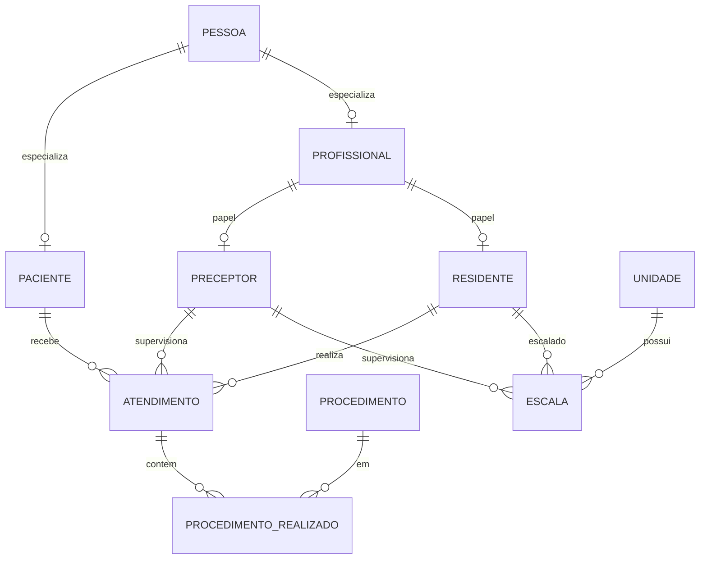

# Modelagem — Sistema de Gestão Hospitalar Dra. Yuska (Etapa 1)

## 1. Contexto e escopo

Este documento é a **fonte da verdade** da modelagem da Etapa 1 (Parte 1 — Miguel):
justificativas de cardinalidade, especialização, modelo relacional e 3FN.

O **DER completo** (entrega em PDF da disciplina) está em:

**[diagrama-der-hospital-residente.pdf](./diagrama-der-hospital-residente.pdf)**

**Incluído:** DER (PDF), cardinalidades, especialização, modelo relacional, evidência de 3FN,
scripts em `db/01_schema.sql`, `db/02_seed.sql`, `db/consultas.sql`.

**Fora de escopo:** backend, frontend, ORM, triggers/procedures (Etapa 2), enforcement
SQL da exclusividade de papéis.

## 2. Diagrama entidade-relacionamento (DER)

Diagrama conceitual com entidades, atributos, relacionamentos e cardinalidades (1 · 0..1 · N):

→ **[diagrama-der-hospital-residente.pdf](./diagrama-der-hospital-residente.pdf)**

Visão esquemática (somente entidades e relacionamentos):

## 3. Cardinalidades

| Relação | Cardinalidade | Justificativa |
|---------|---------------|---------------|
| PESSOA — PACIENTE | 1:0..1 | Especialização joined: no máximo um paciente por pessoa |
| PESSOA — PROFISSIONAL | 1:0..1 | Idem para profissional |
| PROFISSIONAL — PRECEPTOR | 1:0..1 | Papel opcional (0..1) |
| PROFISSIONAL — RESIDENTE | 1:0..1 | Papel opcional (0..1) |
| PACIENTE — ATENDIMENTO | 1:N | Cada atendimento tem exatamente um paciente |
| RESIDENTE — ATENDIMENTO | 1:N | Cada atendimento tem exatamente um residente |
| PRECEPTOR — ATENDIMENTO | 1:N | Cada atendimento tem exatamente um preceptor |
| ATENDIMENTO — PROCEDIMENTO | N:N | Resolvido por `procedimento_realizado` |
| UNIDADE — ESCALA | 1:N | Várias escalas por unidade |
| RESIDENTE — ESCALA | 1:N | Residente em vários plantões |
| PRECEPTOR — ESCALA | 1:N | Preceptor em vários plantões |

## 4. Especialização

### PESSOA → PACIENTE | PROFISSIONAL

Na regra de negócio da disciplina, a especialização é **exclusiva** (uma pessoa é
paciente ou profissional). No SQL da Etapa 1 **não** há constraint que impeça a mesma
`id_pessoa` nas duas subtabelas — exclusividade documentada; enforcement rígido fica
para a Etapa 2 se necessário. A especialização é **parcial**: pode existir só em `pessoa`.

### PROFISSIONAL → PRECEPTOR | RESIDENTE

O enunciado admite histórico (residente depois preceptor), mas “em um dado momento”
apenas um papel. Na Etapa 1 o schema **permite** linhas em ambas as tabelas para o
mesmo profissional; a exclusão mútua é regra de negócio documentada, não enforced
(sem triggers nesta etapa).

## 5. Modelo relacional

### 5.1 Chaves

| Relação | PK | FKs |
|---------|----|-----|
| pessoa | id_pessoa | — |
| paciente | id_pessoa | → pessoa |
| profissional | id_pessoa | → pessoa |
| preceptor | id_profissional | → profissional |
| residente | id_profissional | → profissional |
| unidade | id_unidade | — |
| atendimento | id_atendimento | id_paciente → paciente; id_residente → residente; id_preceptor → preceptor |
| procedimento | id_procedimento | — |
| procedimento_realizado | (id_atendimento, id_procedimento) | → atendimento, → procedimento |
| escala | id_escala | → unidade, → residente, → preceptor; UNIQUE(id_unidade, dia_semana, turno, id_residente) |

### 5.2 Atributos

- **pessoa:** id_pessoa, nome, cpf (UNIQUE), data_nascimento, is_flamengo, telefone
- **paciente:** id_pessoa, num_convenio, alergias, grupo_sanguineo
- **profissional:** id_pessoa, crm (UNIQUE), data_admissao, especialidade
- **preceptor:** id_profissional, titulacao
- **residente:** id_profissional, ano_residencia ∈ {R1,R2,R3}
- **unidade:** id_unidade, nome, tipo ∈ {ENFERMARIA,UTI,PRONTO_SOCORRO,AMBULATORIO}, capacidade_leitos
- **atendimento:** id_atendimento, data_hora, duracao_minutos, id_paciente, id_residente, id_preceptor
- **procedimento:** id_procedimento, codigo (UNIQUE), nome, tempo_medio_minutos, **nivel_risco** ∈ {BAIXO,MEDIO,ALTO}
- **procedimento_realizado:** quantidade, tempo_real_minutos, observacao, **faturado** BOOLEAN DEFAULT FALSE
- **escala:** dia_semana ∈ {SEG..DOM}, turno ∈ {MANHA,TARDE,NOITE}

### 5.3 Acréscimos ao enunciado

| Coluna | Tabela | Motivo |
|--------|--------|--------|
| nivel_risco | procedimento | Consulta de pacientes sem procedimento ALTO |
| faturado | procedimento_realizado | Remoção só se ainda não faturado (req. 3) |

Não há coluna `endereco` no schema oficial; update de paciente (P2) usa convênio/alergias/grupo sanguíneo.

## 6. Normalização até 3FN

1. **1FN:** atributos atômicos; procedimentos de um atendimento em `procedimento_realizado`, não em listas ou colunas repetidas.
2. **2FN:** em `procedimento_realizado`, atributos não-chave dependem da PK composta inteira; nome/risco do procedimento ficam em `procedimento`.
3. **3FN:** sem dependência transitiva — nomes e dados descritivos de pessoa/profissional não são copiados para `atendimento` ou `escala` (apenas FKs). `titulacao` só em `preceptor`; `ano_residencia` só em `residente`.

## 7. DER em PDF

O arquivo de entrega do diagrama é [diagrama-der-hospital-residente.pdf](./diagrama-der-hospital-residente.pdf).
As justificativas de cardinalidade, especialização e normalização estão nas seções 3–6 deste documento.
