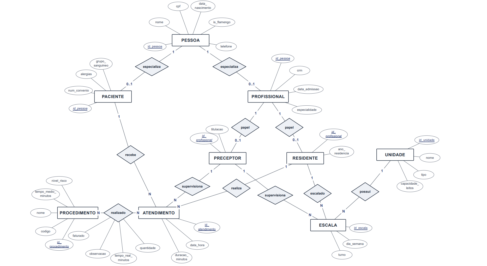
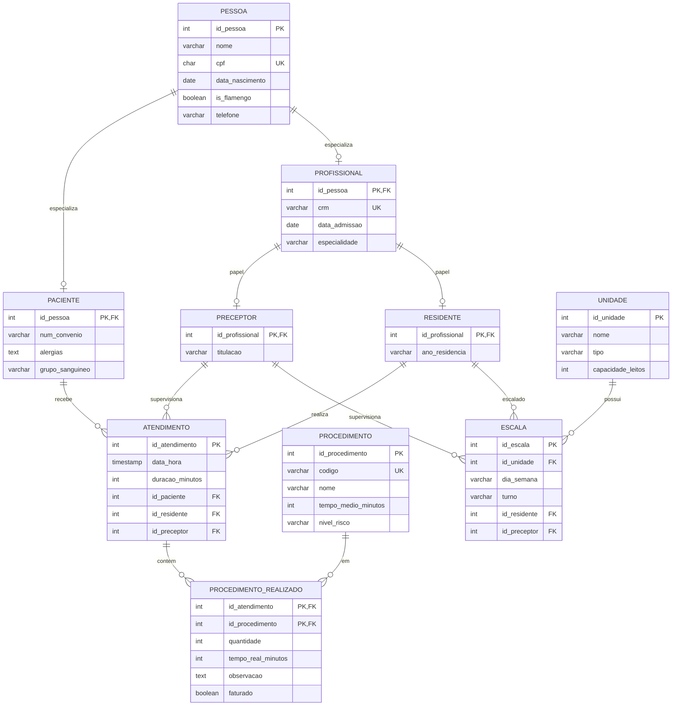

# Modelagem — Sistema de Gestão Hospitalar Dra. Yuska (Etapa 1)

## 1. Diagrama entidade-relacionamento (DER)

DER conceitual completo (entidades, atributos, relacionamentos e cardinalidades):

[diagrama-der-hospital-residente.pdf](./diagrama-der-hospital-residente.pdf)

O PDF já traz, nas páginas 2 e 3, as justificativas de cardinalidade e de especialização — as seções 2 e 3 abaixo são o mesmo conteúdo em texto, para consulta rápida.

Visão do DER (mesmo diagrama do PDF, em notação de Chen):

## 2. Justificativas de cardinalidade

As cardinalidades seguem o enunciado. Em cada par, lê-se **lado A : lado B**.

### 2.1 Especializações (1 : 0..1)

| Relação                  | Card.    | Justificativa                                                                                                                                                                                |
| ------------------------ | -------- | -------------------------------------------------------------------------------------------------------------------------------------------------------------------------------------------- |
| PESSOA — PACIENTE        | 1 : 0..1 | Cada registro de paciente corresponde a **exatamente uma** pessoa (PK compartilhada). Uma pessoa **pode** não ser paciente (especialização parcial), logo o máximo é **um** (0..1), nunca N. |
| PESSOA — PROFISSIONAL    | 1 : 0..1 | Mesma lógica: profissional é uma pessoa; nem toda pessoa é profissional.                                                                                                                     |
| PROFISSIONAL — PRECEPTOR | 1 : 0..1 | Preceptor é um papel do profissional (joined). Em um dado momento ele **pode** não ser preceptor; se for, há no máximo um registro.                                                          |
| PROFISSIONAL — RESIDENTE | 1 : 0..1 | Idem para residente (`ano_residencia`).                                                                                                                                                      |

### 2.2 Atendimento (1 : N)

O enunciado exige **exatamente um** paciente, **um** residente executor e **um** preceptor supervisor por atendimento. Por isso, do lado do atendimento a participação é **1** (obrigatória).

| Relação                 | Card. | Justificativa                                                                                                |
| ----------------------- | ----- | ------------------------------------------------------------------------------------------------------------ |
| PACIENTE — ATENDIMENTO  | 1 : N | Um paciente pode ter **vários** atendimentos ao longo do tempo; cada atendimento pertence a **um** paciente. |
| RESIDENTE — ATENDIMENTO | 1 : N | Um residente realiza **vários** atendimentos; cada atendimento tem **um** residente.                         |
| PRECEPTOR — ATENDIMENTO | 1 : N | Um preceptor supervisiona **vários** atendimentos; cada atendimento tem **um** preceptor.                    |

### 2.3 Procedimentos em atendimento (N : N)

| Relação                    | Card. | Justificativa                                                                                                                                                                                                                                                                                                                                                      |
| -------------------------- | ----- | ------------------------------------------------------------------------------------------------------------------------------------------------------------------------------------------------------------------------------------------------------------------------------------------------------------------------------------------------------------------ |
| ATENDIMENTO — PROCEDIMENTO | N : N | Em um atendimento "podem ser realizados **um ou mais** procedimentos"; o mesmo tipo de procedimento (ex.: sutura) pode ocorrer em **vários** atendimentos. No DER é o relacionamento **realizado**, com atributos próprios (`quantidade`, `tempo_real_minutos`, `observacao` e o acréscimo `faturado`). No MR, vira a tabela associativa `procedimento_realizado`. |

### 2.4 Escalas de plantão (1 : N)

| Relação            | Card. | Justificativa                                                                                                                                         |
| ------------------ | ----- | ----------------------------------------------------------------------------------------------------------------------------------------------------- |
| UNIDADE — ESCALA   | 1 : N | Cada escala ocorre em **uma** unidade; uma unidade tem **várias** escalas (dias/turnos/equipes).                                                      |
| RESIDENTE — ESCALA | 1 : N | Cada escala escala **um** residente; um residente pode ter **vários** plantões.                                                                       |
| PRECEPTOR — ESCALA | 1 : N | Cada escala tem **um** preceptor supervisor daquele plantão; o mesmo preceptor pode supervisionar **vários** plantões (em unidades/turnos distintos). |

**Regra adicional (integridade, não muda a card. 1:N):** a combinação `unidade + dia_semana + turno + residente` é **única** — o mesmo residente não fica no mesmo local/dia/turno com dois preceptores. No MR isso vira `UNIQUE` em `escala`.

## 3. Justificativa da especialização

Adotamos especialização **joined** (subtipos em tabelas próprias, PK = FK do supertipo), alinhada ao schema do enunciado.

### 3.1 PESSOA → PACIENTE | PROFISSIONAL

| Critério              | Decisão                  | Justificativa (enunciado)                                                                                                                                             |
| --------------------- | ------------------------ | --------------------------------------------------------------------------------------------------------------------------------------------------------------------- |
| Total / parcial       | **Parcial**              | A pessoa "**pode** ser" paciente ou profissional — não obriga que toda pessoa já seja um dos dois.                                                                    |
| Disjunta / sobreposta | **Disjunta (exclusiva)** | "Pode ser Paciente **ou** Profissional" — papéis mutuamente exclusivos no modelo conceitual.                                                                          |
| Implementação joined  | Sim                      | Atributos específicos ficam só no subtipo (`num_convenio`/`alergias`/`grupo_sanguineo` vs `crm`/`data_admissao`/`especialidade`), evitando colunas nulas em `pessoa`. |

### 3.2 PROFISSIONAL → PRECEPTOR | RESIDENTE

| Critério              | Decisão                        | Justificativa (enunciado)                                                                                                                                                                         |
| --------------------- | ------------------------------ | ------------------------------------------------------------------------------------------------------------------------------------------------------------------------------------------------- |
| Total / parcial       | **Parcial**                    | O profissional "**pode** ser" preceptor ou residente; não há obrigatoriedade de já ter um papel cadastrado.                                                                                       |
| Disjunta / sobreposta | **Disjunta no presente**       | "Em um dado momento ele ocupa **apenas um** papel".                                                                                                                                               |
| Histórico             | Fora do schema da Etapa 1      | O profissional pode ter sido residente e depois preceptor em **períodos** diferentes; isso exigiria vigência temporal, que **não** é requisito da Etapa 1. Modelamos só o papel atual (disjunto). |
| Atributos no subtipo  | `titulacao` / `ano_residencia` | Só fazem sentido no papel correspondente.                                                                                                                                                         |

### 3.3 Nota sobre o enforcement da disjunção (SQL da Etapa 1)

No DER as duas especializações são **parciais e disjuntas**. No `CREATE TABLE` da Etapa 1 (sem triggers) a exclusão mútua **não** é enforced por constraint, em **nenhum** dos dois níveis:

- **PESSOA → PACIENTE | PROFISSIONAL:** o banco *aceitaria* a mesma `id_pessoa` em `paciente` e `profissional`.
- **PROFISSIONAL → PRECEPTOR | RESIDENTE:** o banco *aceitaria* o mesmo `id_profissional` em `preceptor` e `residente`.

É uma limitação inerente às constraints declarativas no modelo *joined*: uma `FK` só verifica a existência no supertipo (não a ausência na tabela irmã), um `CHECK` só enxerga colunas da própria linha e o `UNIQUE` só age dentro de uma tabela. Para enforcar de fato seria preciso um **trigger** (Etapa 2) ou o padrão de **discriminador com FK composta** (que desviaria do schema do enunciado). Na Etapa 1 a disjunção fica como regra de negócio documentada, e o seed respeita um único papel por pessoa/profissional.

## 4. Modelo relacional

### 4.1 Esquema relacional

Marcadores: `PK` = chave primária · `FK` = chave estrangeira · `UK` = restrição de unicidade (`UNIQUE`).

**Chave única composta (não representável por coluna no diagrama):** `ESCALA` tem `UNIQUE(id_unidade, dia_semana, turno, id_residente)`.

As FKs de `atendimento` apontam para os **subtipos** (`residente`, `preceptor`), não para `profissional` — assim a integridade referencial já garante que o executor é um residente e o supervisor é um preceptor.

**Domínios (aplicados via** `CHECK` **no schema):** `tipo` ∈ {ENFERMARIA, UTI, PRONTO_SOCORRO, AMBULATORIO}; `nivel_risco` ∈ {BAIXO, MEDIO, ALTO}; `ano_residencia` ∈ {R1, R2, R3}; `dia_semana` ∈ {SEG..DOM}; `turno` ∈ {MANHA, TARDE, NOITE}.

### 4.2 Acréscimos ao enunciado

| Coluna        | Tabela                 | Motivo                                                         |
| ------------- | ---------------------- | -------------------------------------------------------------- |
| `nivel_risco` | procedimento           | Consulta de pacientes sem procedimento de risco ALTO (req. 4). |
| `faturado`    | procedimento_realizado | Remoção de procedimento só se ainda não faturado (req. 3).     |

Não há coluna `endereco` no schema oficial; a atualização de paciente altera apenas `num_convenio` / `alergias` / `grupo_sanguineo`.

### 4.3 Nota de modelagem: `escala` é grade semanal

`escala` modela a organização dos plantões como **recorrência semanal** (`dia_semana` + `turno`), **sem data de calendário**, conforme o enunciado. Consequência: não há um "mês" a filtrar diretamente na tabela — a consulta 3 do req. 4 ("plantões no mês corrente") é resolvida sobre a grade vigente. Optou-se por manter o schema fiel ao enunciado em vez de adicionar uma competência (`ano`/`mes`), que exigiria alterar o `UNIQUE`.

## 5. Normalização até a 3FN

Todas as relações estão na **3FN**. Análise por forma normal:

1. **1FN (atributos atômicos, sem grupos repetidos):** todos os atributos são monovalorados e atômicos. Os vários procedimentos de um atendimento não viram colunas repetidas nem lista — são linhas em `procedimento_realizado`.
2. **2FN (sem dependência parcial da chave):** a única chave composta é a de `procedimento_realizado` (`id_atendimento`, `id_procedimento`); seus atributos não-chave (`quantidade`, `tempo_real_minutos`, `observacao`, `faturado`) dependem do **par inteiro**. O que depende só do procedimento (`nome`, `tempo_medio_minutos`, `nivel_risco`) fica em `procedimento`; o que depende só do atendimento (`data_hora`, `duracao_minutos`, …) fica em `atendimento`. As demais tabelas têm PK simples, logo satisfazem 2FN trivialmente.
3. **3FN (sem dependência transitiva):** nenhum atributo não-chave depende de outro atributo não-chave. Dados descritivos não são replicados — `atendimento` e `escala` guardam apenas FKs (não copiam nome/CPF/titulação); `titulacao` vive só em `preceptor` e `ano_residencia` só em `residente`. A especialização joined evita a dependência transitiva típica de uma tabela "achatada" (paciente e profissional juntos).

