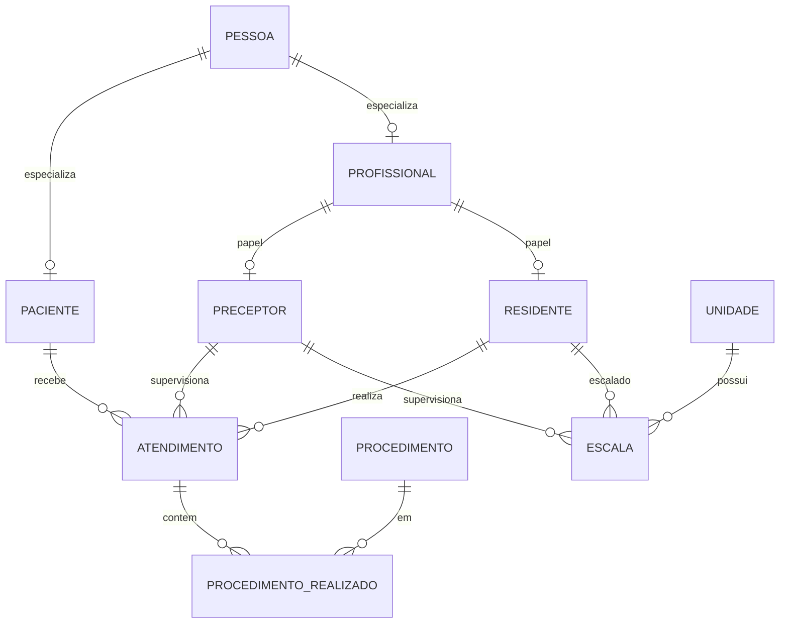

# Modelagem — Sistema de Gestão Hospitalar Dra. Yuska (Etapa 1)

## 1. Contexto e escopo

Este documento é a **fonte da verdade** da modelagem da Etapa 1 (Parte 1 — Miguel):
justificativas de cardinalidade, especialização, modelo relacional e 3FN.

O **DER completo** (entrega em PDF da disciplina) está em:

**[diagrama-der-hospital-residente.pdf](./diagrama-der-hospital-residente.pdf)**

**Incluído:** DER (PDF), cardinalidades, especialização, modelo relacional, evidência de 3FN,
scripts em `db/01_schema.sql`, `db/02_seed.sql`, `db/consultas.sql`.

**Fora de escopo:** backend, frontend, ORM, triggers/procedures (Etapa 2), enforcement
SQL da exclusividade de papéis.

## 2. Diagrama entidade-relacionamento (DER)

Diagrama conceitual com entidades, atributos, relacionamentos e cardinalidades (1 · 0..1 · N):

→ **[diagrama-der-hospital-residente.pdf](./diagrama-der-hospital-residente.pdf)**

Visão esquemática (somente entidades e relacionamentos):

## 3. Justificativas de cardinalidade

As cardinalidades seguem o enunciado. Em cada par, lê-se **lado A : lado B**.

### 3.1 Especializações (1 : 0..1)

| Relação | Card. | Justificativa |
|---------|-------|---------------|
| PESSOA — PACIENTE | 1 : 0..1 | Cada registro de paciente corresponde a **exatamente uma** pessoa (PK compartilhada). Uma pessoa **pode** não ser paciente (especialização parcial), logo o máximo no subtítulo é **um** (0..1), nunca N. |
| PESSOA — PROFISSIONAL | 1 : 0..1 | Mesma lógica: profissional é uma pessoa; nem toda pessoa é profissional. |
| PROFISSIONAL — PRECEPTOR | 1 : 0..1 | Preceptor é um papel do profissional (joined). Em um dado momento o profissional **pode** não ser preceptor; se for, há no máximo um registro de preceptor. |
| PROFISSIONAL — RESIDENTE | 1 : 0..1 | Idem para residente (`ano_residencia`). |

### 3.2 Atendimento (1 : N)

O enunciado exige **exatamente um** paciente, **exatamente um** residente executor e **exatamente um** preceptor supervisor por atendimento. Por isso, do lado do atendimento a participação é **1** (obrigatória). Do outro lado:

| Relação | Card. | Justificativa |
|---------|-------|---------------|
| PACIENTE — ATENDIMENTO | 1 : N | Um paciente pode ter **vários** atendimentos ao longo do tempo; cada atendimento pertence a **um** paciente. |
| RESIDENTE — ATENDIMENTO | 1 : N | Um residente realiza **vários** atendimentos; cada atendimento tem **um** residente. |
| PRECEPTOR — ATENDIMENTO | 1 : N | Um preceptor supervisiona **vários** atendimentos; cada atendimento tem **um** preceptor. |

### 3.3 Procedimentos em atendimento (N : N)

| Relação | Card. | Justificativa |
|---------|-------|---------------|
| ATENDIMENTO — PROCEDIMENTO | N : N | Em um atendimento “podem ser realizados **um ou mais** procedimentos”; o mesmo tipo de procedimento (ex.: sutura) pode ocorrer em **vários** atendimentos. No DER conceitual isso é o relacionamento **realizado**, com atributos próprios (`quantidade`, `tempo_real_minutos`, `observacao`, e o acréscimo `faturado`). No MR, vira a tabela associativa `procedimento_realizado`. |

### 3.4 Escalas de plantão (1 : N)

| Relação | Card. | Justificativa |
|---------|-------|---------------|
| UNIDADE — ESCALA | 1 : N | Cada escala ocorre em **uma** unidade; uma unidade tem **várias** escalas (dias/turnos/equipes). |
| RESIDENTE — ESCALA | 1 : N | Cada escala escala **um** residente; um residente pode ter **vários** plantões. |
| PRECEPTOR — ESCALA | 1 : N | Cada escala tem **um** preceptor supervisor daquele plantão; o mesmo preceptor pode supervisionar **vários** plantões (em unidades/turnos distintos, conforme o enunciado). |

**Regra adicional (integridade, não muda a card. 1:N):** a combinação `unidade + dia_semana + turno + residente` é **única** — o mesmo residente não fica no mesmo local/dia/turno com dois preceptores. No MR isso vira `UNIQUE` em `escala`.

## 4. Justificativa da especialização

Adotamos especialização **joined** (subtipos em tabelas próprias, PK = FK do supertipo), alinhada ao schema do enunciado.

### 4.1 PESSOA → PACIENTE | PROFISSIONAL

| Critério | Decisão | Justificativa (enunciado) |
|----------|---------|---------------------------|
| Total / parcial | **Parcial** | O texto diz que a pessoa “**pode** ser” paciente ou profissional — não obriga que toda pessoa já seja um dos dois. |
| Disjunta / sobreposta | **Disjunta (exclusiva)** | “Pode ser Paciente **ou** Profissional” — no modelo conceitual, papéis mutuamente exclusivos. |
| Implementação joined | Sim | Atributos específicos ficam só no subtipo (`num_convenio`/`alergias`/`grupo_sanguineo` vs `crm`/`data_admissao`/`especialidade`), evitando colunas nulas em `pessoa`. |

### 4.2 PROFISSIONAL → PRECEPTOR | RESIDENTE

| Critério | Decisão | Justificativa (enunciado) |
|----------|---------|---------------------------|
| Total / parcial | **Parcial** | O profissional “**pode** ser” preceptor ou residente; não há obrigatoriedade de já ter um papel cadastrado. |
| Disjunta / sobreposta | **Disjunta no presente** | “Em um dado momento ele ocupa **apenas um** papel”. |
| Histórico | Fora do schema da Etapa 1 | O enunciado cita que o profissional pode ter sido residente e depois preceptor em **períodos** diferentes; isso exigiria vigência temporal, que **não** é requisito da Etapa 1. Modelamos só o papel atual (disjunto). |
| Atributos no subtipo | `titulacao` / `ano_residencia` | Só fazem sentido no papel correspondente. |

### 4.3 Nota de implementação (SQL da Etapa 1)

No DER/conceitual as duas especializações são **parciais e disjuntas**. No `CREATE TABLE` da Etapa 1 (sem triggers) a exclusão mútua **não** é enforced por constraint, em **nenhum** dos dois níveis:

- **PESSOA → PACIENTE | PROFISSIONAL:** o banco *aceitaria* a mesma `id_pessoa` em `paciente` e `profissional`.
- **PROFISSIONAL → PRECEPTOR | RESIDENTE:** o banco *aceitaria* o mesmo `id_profissional` em `preceptor` e `residente`.

Isso é uma limitação inerente às constraints declarativas no modelo *joined*: uma `FK` só verifica a existência no supertipo (não a ausência na tabela irmã), um `CHECK` só enxerga colunas da própria linha e o `UNIQUE` só age dentro de uma tabela. Para enforcar de fato seria preciso um **trigger** (Etapa 2) ou o padrão de **discriminador com FK composta** (que desviaria do schema do enunciado). Na Etapa 1 a disjunção fica como regra de negócio/documentação, e o seed respeita um único papel por pessoa/profissional.

## 5. Modelo relacional

### 5.1 Chaves

| Relação | PK | FKs |
|---------|----|-----|
| pessoa | id_pessoa | — |
| paciente | id_pessoa | → pessoa |
| profissional | id_pessoa | → pessoa |
| preceptor | id_profissional | → profissional |
| residente | id_profissional | → profissional |
| unidade | id_unidade | — |
| atendimento | id_atendimento | id_paciente → paciente; id_residente → residente; id_preceptor → preceptor |
| procedimento | id_procedimento | — |
| procedimento_realizado | (id_atendimento, id_procedimento) | → atendimento, → procedimento |
| escala | id_escala | → unidade, → residente, → preceptor; UNIQUE(id_unidade, dia_semana, turno, id_residente) |

### 5.2 Atributos

- **pessoa:** id_pessoa, nome, cpf (UNIQUE), data_nascimento, is_flamengo, telefone
- **paciente:** id_pessoa, num_convenio, alergias, grupo_sanguineo
- **profissional:** id_pessoa, crm (UNIQUE), data_admissao, especialidade
- **preceptor:** id_profissional, titulacao
- **residente:** id_profissional, ano_residencia ∈ {R1,R2,R3}
- **unidade:** id_unidade, nome, tipo ∈ {ENFERMARIA,UTI,PRONTO_SOCORRO,AMBULATORIO}, capacidade_leitos
- **atendimento:** id_atendimento, data_hora, duracao_minutos, id_paciente, id_residente, id_preceptor
- **procedimento:** id_procedimento, codigo (UNIQUE), nome, tempo_medio_minutos, **nivel_risco** ∈ {BAIXO,MEDIO,ALTO}
- **procedimento_realizado:** quantidade, tempo_real_minutos, observacao, **faturado** BOOLEAN DEFAULT FALSE
- **escala:** dia_semana ∈ {SEG..DOM}, turno ∈ {MANHA,TARDE,NOITE}

### 5.3 Acréscimos ao enunciado

| Coluna | Tabela | Motivo |
|--------|--------|--------|
| nivel_risco | procedimento | Consulta de pacientes sem procedimento ALTO |
| faturado | procedimento_realizado | Remoção só se ainda não faturado (req. 3) |

Não há coluna `endereco` no schema oficial; update de paciente (P2) usa convênio/alergias/grupo sanguíneo.

### 5.4 Limitação conhecida: consulta 3 ("mês corrente")

O requisito 4 pede, para cada unidade, "a quantidade de plantões escalados por residente **no mês corrente**". Porém `escala` segue o schema do enunciado, que modela a grade como **recorrência semanal** (`dia_semana` ∈ {SEG..DOM} + `turno`), **sem data de calendário**. Não existe, portanto, um mês a filtrar.

**Decisão:** manter o schema exatamente como o enunciado define (sem adicionar coluna de data/competência) e interpretar "mês corrente" como **as escalas vigentes no sistema**. A consulta 3 (`db/consultas.sql`) agrega os plantões por unidade e residente sobre a grade vigente.

A alternativa seria acrescentar uma competência (`ano`/`mes`) e incluí-la no `UNIQUE`, mas isso desviaria do `UNIQUE(id_unidade, dia_semana, turno, id_residente)` fixado no enunciado; optou-se pela fidelidade ao modelo dado.

## 6. Normalização até 3FN

1. **1FN:** atributos atômicos; procedimentos de um atendimento em `procedimento_realizado`, não em listas ou colunas repetidas.
2. **2FN:** em `procedimento_realizado`, atributos não-chave dependem da PK composta inteira; nome/risco do procedimento ficam em `procedimento`.
3. **3FN:** sem dependência transitiva — nomes e dados descritivos de pessoa/profissional não são copiados para `atendimento` ou `escala` (apenas FKs). `titulacao` só em `preceptor`; `ano_residencia` só em `residente`.

## 7. DER em PDF

O diagrama está em [diagrama-der-hospital-residente.pdf](./diagrama-der-hospital-residente.pdf).
Para a entrega do req. 1, anexe ao PDF (ex.: página seguinte) as **seções 3 e 4** deste arquivo — são as justificativas de cardinalidade e especialização pedidas no enunciado.
