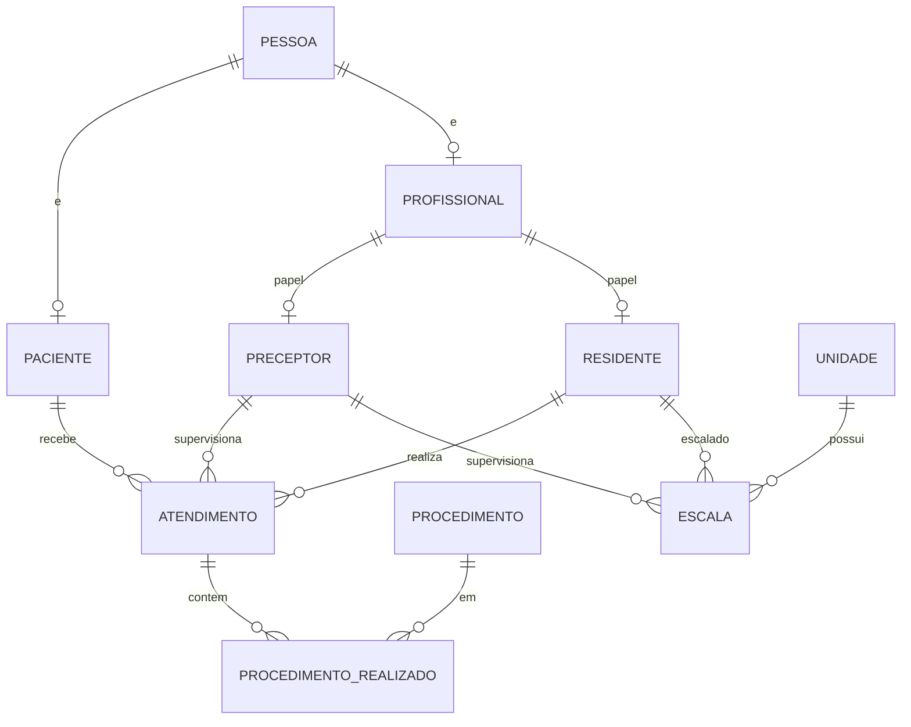

# Etapa 1 - Sistema de Gestão Hospitalar Dra. Yuska

## Objetivo
Entregar os requisitos 1-4 (+5 extra) da Etapa 1: modelagem relacional, schema PostgreSQL com constraints, dados de teste, CRUD e consultas analíticas via **SQL puro** (sem ORM), expostos por FastAPI e demonstrados em uma UI Next.js. Código conciso, profissional, mínimo de comentários.

## Stack
- **DB:** PostgreSQL (local, sem Docker)
- **Backend:** FastAPI + `psycopg` (SQL puro, sem SQLAlchemy)
- **Frontend:** Next.js (App Router) + fetch para a API

## Divisão (3 pessoas, cada uma apresenta sua parte)

### P1 - Modelagem & Banco de Dados (Requisitos 1 e 2) - Miguel
**Responsável por toda a fundação de dados e pela justificativa teórica.**
- Arquivos: `db/01_schema.sql`, `db/02_seed.sql`, `db/consultas.sql` (referência).
- Entregas:
  - DER completo (PDF) com justificativa de cardinalidades e da especialização (PESSOA → PACIENTE/PROFISSIONAL → PRECEPTOR/RESIDENTE).
  - Modelo relacional: todas as tabelas com PK e FK.
  - Evidência de normalização até a 3FN (justificar ausência de dependências parciais/transitivas).
  - `CREATE TABLE` de todas as tabelas com constraints (PK, FK, CHECK, NOT NULL, UNIQUE).
  - Massa de dados de teste (mínimos do enunciado).
- Na apresentação: explica o modelo, as constraints e a normalização, e roda os scripts SQL.

### P2 - Backend FastAPI / SQL puro (Requisitos 3 e 4) -  Rafael
**Responsável por toda a lógica de acesso a dados sem ORM.**
- Arquivos: `backend/app/*` (`db.py`, `schemas.py`, `crud.py`, `analytics.py`, `main.py`), `requirements.txt`, `.env.example`.
- Entregas:
  - 6 endpoints CRUD do requisito 3 (SQL puro, com validação de existência e a regra da flag `faturado`).
  - 4 consultas analíticas do requisito 4 (SQL puro).
  - Tratamento de erros (404/409) e conexão com o PostgreSQL via `psycopg`.
- Na apresentação: demonstra os endpoints (via `/docs` do FastAPI) e explica cada consulta SQL.

### P3 - Frontend Next.js (Interface e demonstração) - Luigi
**Responsável pela interface que exercita e demonstra tudo.**
- Arquivos: `frontend/*`.
- Entregas:
  - Telas de CRUD (listar/inserir atendimento, ver procedimentos, editar paciente).
  - Painel com as 4 consultas analíticas.
  - Integração com a API via `fetch`.
- Na apresentação: faz a demo de ponta a ponta pela interface.

> Dependência de integração: P1 entrega o schema primeiro; P2 consome o banco; P3 consome a API. O `README.md` (req 5) é redigido em conjunto.

## Estrutura do repositório
```
projeto-bd/
├── plan.md                 (este plano)
├── README.md               (instalação + execução - req 5)
├── db/
│   ├── 01_schema.sql       (CREATE TABLE + constraints)
│   ├── 02_seed.sql         (dados de teste)
│   └── consultas.sql       (as 4 consultas analíticas, referência)
├── backend/
│   ├── requirements.txt
│   ├── .env.example        (DATABASE_URL)
│   └── app/
│       ├── main.py         (app + CORS + include routers)
│       ├── db.py           (conexão/pool psycopg)
│       ├── schemas.py      (modelos Pydantic de entrada/saída)
│       ├── crud.py         (router: requisito 3)
│       └── analytics.py    (router: requisito 4)
└── frontend/               (Next.js app)
```

## Modelo de dados (ajustes sobre o enunciado)
Segue o schema da Etapa 1 com 2 acréscimos necessários pelos requisitos:
- `PROCEDIMENTO.nivel_risco` (`CHECK IN ('BAIXO','MEDIO','ALTO')`) - exigido pela consulta de risco ALTO.
- `PROCEDIMENTO_REALIZADO.faturado BOOLEAN DEFAULT FALSE` - flag para a regra de remoção.
- Update de paciente: como não há `endereco` no schema, atualiza `num_convenio` / `alergias` / `grupo_sanguineo`.

Tabelas: `PESSOA`, `PACIENTE`, `PROFISSIONAL`, `PRECEPTOR`, `RESIDENTE`, `UNIDADE`, `ATENDIMENTO`, `PROCEDIMENTO`, `PROCEDIMENTO_REALIZADO` (PK composta), `ESCALA` (`UNIQUE(id_unidade, dia_semana, turno, id_residente)`).



## Dados de teste (req 2 - mínimos)
5 pacientes, 5 residentes, 5 preceptores, 3 unidades, 10 atendimentos, 10 procedimentos realizados (+ procedimentos com `nivel_risco` variados e algumas escalas).

## Endpoints da API
**CRUD (req 3) - `crud.py`:**
- `POST /atendimentos` - insere atendimento validando existência de paciente/residente/preceptor.
- `GET /pacientes/{id}/atendimentos` - atendimentos do paciente, ordenados por `data_hora`.
- `GET /atendimentos/{id}/procedimentos` - nome do procedimento, quantidade, tempo real.
- `PUT /pacientes/{id}` - atualiza convênio/alergias/grupo sanguíneo.
- `DELETE /atendimentos/{id}/procedimentos/{cod}` - remove só se `faturado = FALSE`.
- `GET /residentes/tempo-medio` - tempo médio de duração de atendimentos por residente.

**Analíticas (req 4) - `analytics.py`:**
- `GET /analytics/ranking-residentes` - nome + total de atendimentos (ordenado).
- `GET /analytics/preceptores-supervisao?mes=YYYY-MM` - preceptores com > 5 atendimentos supervisionados no mês.
- `GET /analytics/plantoes-por-unidade` - por unidade, plantões escalados por residente no mês corrente.
- `GET /analytics/pacientes-sem-risco-alto` - pacientes que nunca fizeram procedimento `nivel_risco = 'ALTO'`.

## Frontend Next.js (P3)
Páginas mínimas que exercitam a API: listar/inserir atendimento, ver procedimentos de um atendimento, editar paciente, e um painel com as 4 consultas analíticas. UI limpa, sem excesso.

## Documentação (req 5)
`README.md` com: pré-requisitos, criar DB + rodar `db/*.sql`, configurar `.env`, subir backend (`uvicorn`) e frontend (`next dev`).

## Fora de escopo
Etapa 2 (procedures, triggers, views, ORM). O DER em PDF é produzido pela P1 separadamente (a modelagem/justificativas ficam documentadas, mas o PDF é entrega manual).
